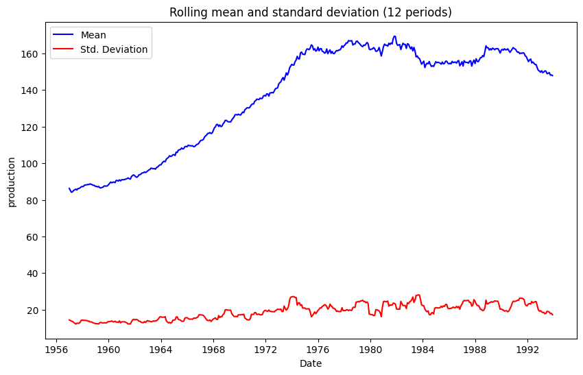
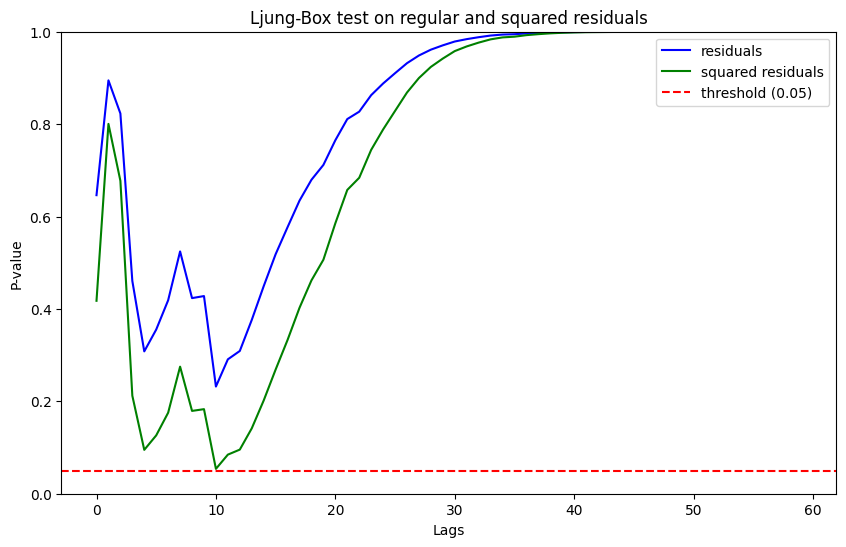
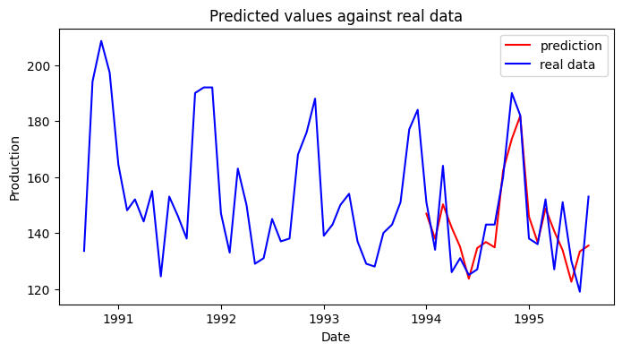

# SARIMA Time Series Analysis

**Implementing a seasonal autoregressive integrated moving average (SARIMA) model to predict future production of beer.**

## Project overview
Being able to make data-driven predictions on the expected behavior of the market is essential for companies. When working with time series, especially ones that exhibit strong seasonal patterns such as this one, it is extremely useful to have a tool to be able to get a sense of how the market Will behave looking forward taking past behavior as a reference point.

## The data
The data for this Project was obtained through a publicly available Kaggle dataset on beer production. The dataset can be accessed [here](https://www.kaggle.com/datasets/saadsikander/beer-production/data). All the data is contained within a single file, monthly-beer-production-in-austr.csv, which can be found in the data folder of this project. The dataset included 2 columns:

| Feature | Description | Data type |
|:--- | :--- | :--- |
| Month	 | Month of the year | String |
| Monthly Beer Production | Beer production for that month | Float |

## Project development
In order to build the SARIMA model, it's necessary to first determine whether the data is stationary, as this is one of the key assumptions of the model). Then, the order of the parameters must be determined. These two processes Will be discussed in this section.

### Checking for stationarity
The data was found to not be stationary. This was confirmed both visually and statistically. The visual approach entailed plotting the data, as well as the rolling mean and rolling standard deviation to see if they remained constant over time. Figure 1 below shows the rolling mean and standard deviation with a window of 12.

*Figure 1: Rolling mean and rolling standard deviation showing the data is not stationary.*

This was further corrborated using the ADF and KPSS tests. The results of both of these tests suggested that the data was not stationary even at an alpha value of 0.01. Knowing this, the data was made stationary by applying a log transformation to the data in order to address the non-constant variance and then applying differencing to account for non-stationarity in terms of trend.

### Determining the orders of the parameters
Having made the data stationary, the ACF and PACF plots of the now stationary data was checked to determine the order of both seasonal and non-seasonal parameters. After the visual inspection, it was determined that the best model was a SARIMA(2, 1, 1)(1, 0, 1, 12). All model parameters were found to be statistically significant, and, in order to check that the residuals were independent, the Ljung-Box test was conducted. The residuals were found to have no correlation.

*Figure 2: Ljung-Box test on the model's residuals and squared residuals showing they're not correlated at an alpha of 0.05[1](#footnote1).*

<a name = "footnote1">1</a>: The p-value at lag 10 (the minimum value in the entire series) is of 0.0538, meaning that, while close to the threshold, is not enough to reject the null hypothesis of the test.

In order to corroborate the parameter orders found visually, a grid search was conducted to test for multiple combinations of parameters. The AIC value was used as a metric to find the best model. According to the grid search, the best model was a SARIMA(4, 1, 3)(1, 0, 2, 12). This was, however, rejected in favor of the first model due to two main reasons:
- The model is more complex, and, according to the principle of parsimony, if the same results can be achieved with a simpler model, the simpler model is preferred.
- The test MSE was later found to be higher for the grid search model, which suggests that it was overfitting the data.

Below is Figure 3 showcasing the visual validation of the final model.

*Figure 3: Visual validation of the final model. Predicted data against actual data.*

The full analysis, including the evaluation of the model, can be found [here](sarima_analysis.ipynb).

## How to explore this repository
**Analysis:** View the full the analysis in the [Jupyter Notebook](sarima-analysis.ipynb) for full EDA and modelling.

**Reproduction:** Run `pip install -r requirements.txt` to set up the environment.